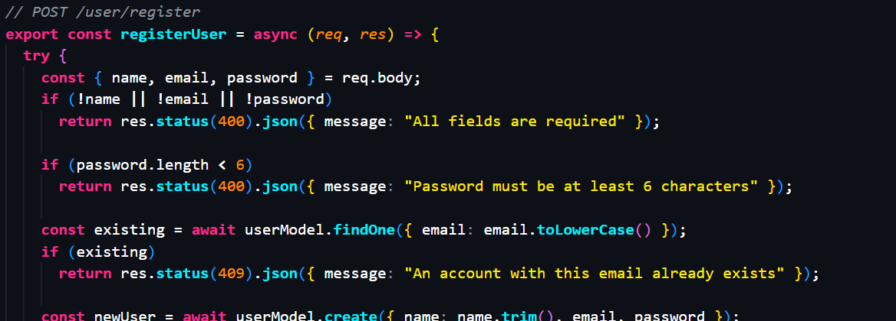

# RagCoder Dark Theme (v2 Hyper-Vibrant Harmony Edition)

## 📌 Overview

The **RagCoder Dark Theme** is a custom-built Visual Studio Code color theme designed to enhance code readability, reduce eye strain, and provide a visually pleasing development experience.

**✨ NEW in v2:** The theme has been completely redesigned with a "Hyper-Vibrant Harmony" aesthetic—combining a deep, elegant Midnight Slate background with intense, glossy neon syntax highlighting for maximum contrast and developer comfort.

This project demonstrates practical experience with **VS Code extension development**, design systems, accessibility-aware UI decisions, and real-world deployment through the **VS Code Marketplace**.

🔗 **Marketplace:** [RagCoder Dark Theme](https://marketplace.visualstudio.com/items?itemName=ragcoder-dev.ragcoder-dark)

---

## 📸 Demo



---

## 🎯 Goals & Motivation

* Improve code readability across multiple programming languages
* Reduce eye strain during extended development sessions
* Apply accessibility-focused color contrast principles
* Learn the end-to-end process of building, publishing, and maintaining a VS Code extension

---

## 🎨 Theme Design Philosophy (v2)

The V2 upgrade of the theme is designed with the following principles in mind:

* **Harmonious Midnight Slate Base:** A deeply sophisticated `#0D1117` background that replaces harsh pure black, providing the perfect canvas to reduce eye strain while supporting high-saturation colors.
* **Hyper-Vibrant Neon Tokens:** Cranked up saturation for keywords, strings, variables, and functions. They glow like a glossy screen, providing unmistakable, instantaneous syntax recognition.
* **Premium UI Layering:** Activity bars and panels use slightly darker recessed tones (`#010409`) to frame your code beautifully.
* **Accessibility-aware contrast:** The neon colors against the deep slate base ensure you can code for hours comfortably without losing the "wow" factor.

The result is a theme that feels like a premium, cyberpunk-inspired environment tailored for modern web development.

---

## 🧩 Features

* ✔ **Hyper-Vibrant Neon** syntax highlighting for instant pattern recognition
* ✔ **Deep Midnight Slate** editor background for elegant contrast without clashing
* ✔ Optimized for React, TypeScript, and modern JS frameworks
* ✔ Polished UI tokens including a glowing cursor and active tab borders
* ✔ Rich, colorful terminal ANSI support that perfectly matches the editor palette

---

## 🧑‍💻 Language Support

The theme provides customized syntax highlighting for:

* JavaScript / TypeScript
* React (JSX / TSX)
* HTML & CSS
* JSON
* Python
* Java
* C / C++

Token color rules are carefully tuned to ensure clarity across different language grammars.

---

## 🛠️ Technical Implementation

### Extension Structure

* Built using VS Code’s **theme extension API**
* Uses JSON-based theme configuration
* Token scopes mapped to syntax elements

Example configuration areas:

* Editor background & foreground
* Syntax tokens (keywords, strings, comments)
* UI elements (tabs, sidebar, status bar)

---

## 🚀 Publishing & Deployment

* Packaged and published using `vsce`
* Deployed to the **Visual Studio Code Marketplace**
* Versioned using **Git** and semantic versioning
* Supports future updates and improvements

This demonstrates experience with **real-world extension lifecycle management**.

---

## 🔄 Maintenance & Updates

* Bug fixes and refinements based on usage feedback
* Incremental improvements to color contrast
* Support for additional languages and UI components

---

## 📦 Installation

### From VS Code Marketplace

1. Open VS Code
2. Go to Extensions (`Ctrl + Shift + X`)
3. Search for the theme name
4. Click **Install**
5. Select the theme from the Color Theme menu

### Manual Installation

```bash
code --install-extension your-theme-name.vsix
```

---

## 📈 Future Enhancements

* Additional theme variants (lighter / softer contrast)
* Better semantic token support
* Community feedback-based improvements

---

## 🎓 What This Project Demonstrates

* Understanding of **developer experience (DX)**
* Accessibility-conscious UI design
* VS Code extension ecosystem knowledge
* Publishing and maintaining a real developer tool

---

⭐ If you like this theme, consider leaving a review on the VS Code Marketplace!
